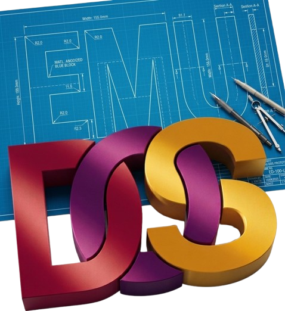

  

A good-looking, Boxer-style DOS gaming frontend for Windows. Drop your games in and they appear as boxes on a shelf — art downloaded automatically, sensible settings applied for you, and Roland MT-32 music (with a working LCD) when you supply the ROMs.

Inspired by [Boxer](http://boxerapp.com/) for the Mac, built Windows-first.

> **📖 Full documentation is on the [Wiki](https://github.com/codingncaffeine/EmuDOS/wiki)** — features, usage, and the tech behind it. (The same guide ships with the app as `README.txt`.)

## Highlights

- **Bookshelf library** — your games as box art on a shelf; drop a folder, `.zip`, or CD image to import.
- **2D & 3D box art** — downloaded automatically (ScreenScraper, with a SteamGridDB fallback); choose 2D or 3D per game or library-wide, or drop in your own cover.
- **Just-works settings** — a curated catalog applies known-good DOSBox options on import; everything is overridable per game and survives updates.
- **Discs & Windows** — multi-disc games, disc swapping, and installing/booting a full Windows 9x.
- **Roland MT-32** — drop the ROMs in and MT-32 games use them, with an on-screen dot-matrix LCD.
- **Save states**, **screenshots/recording**, **mouse lock**, and a **smart launcher** that picks the right program.

See the **[Wiki](https://github.com/codingncaffeine/EmuDOS/wiki)** for the details on all of these.

## Quick start

1. Install the **.NET 10 SDK**.
2. `dotnet build -c Release`
3. Run `EmuDOS.exe`. On first launch it downloads the DOSBox Pure core (Preferences → Downloads).
4. Drag a game folder, `.zip`, or disc image onto the window. It appears on the shelf with art.
5. Click a box to play; right-click for options.

Games run through the **dosbox_pure** libretro core, loaded directly with no manual config. Each game is a self-contained **gamebox** folder, so backing up or moving the folder moves the whole game — the library database is just a rebuildable index over those folders. See [How It Works](https://github.com/codingncaffeine/EmuDOS/wiki/How-It-Works) for the full picture.

## Project layout

| Project | Purpose |
|---|---|
| `src/EmuDOS` | WPF app — the shelf UI and emulator window |
| `src/EmuDOS.Core` | libretro host, dosbox_pure interop, render/input/audio, import, catalog |
| `src/EmuDOS.Metadata` | box art & manual sources (ScreenScraper, SteamGridDB, Internet Archive) |
| `src/native/mt32` | the MT-32 synth shim (C over munt) — see below |
| `tests/EmuDOS.Tests` | unit tests |

## MT-32 and the ROMs

EmuDOS plays MT-32 music with its own synth (a small DLL built from [munt](https://github.com/munt/munt), shipped with the app). It needs the **Roland MT-32 (or CM-32L) ROMs**, which are **Roland's copyrighted firmware** — we can't and don't distribute them. Supply your own by dragging the `.rom` files (or a folder containing them) onto EmuDOS; the Downloads tab shows whether they're detected.

## Credits

EmuDOS stands on the work of others, with thanks:

- **[Boxer](http://boxerapp.com/)** by Alun Bestor — the Mac DOS frontend that inspired EmuDOS, and the reference for recreating the Roland MT-32 LCD.
- **[DOSBox Pure](https://github.com/schellingb/dosbox-pure)** by Bernhard Schelling, and the **[DOSBox](https://www.dosbox.com/)** project it builds on — the emulator that runs the games.
- **[munt / mt32emu](https://github.com/munt/munt)** — the Roland MT-32 emulation behind our synth.
- **[eXoDOS](https://www.retro-exo.com/exodos.html)** — the DOS configuration set our catalog is seeded from.
- **[libretro](https://www.libretro.com/)** — the core API EmuDOS hosts.
- **[FFmpeg](https://ffmpeg.org/)** — optional gameplay video recording.
- **[ScreenScraper](https://www.screenscraper.fr/)**, **[SteamGridDB](https://www.steamgriddb.com/)**, and the **[Internet Archive](https://archive.org/)** — box art and manuals.

## Third-party components

- **DOSBox Pure** (libretro core) — GPLv2; downloaded at runtime, never bundled.
- **FFmpeg** — GPL; downloaded on demand for the optional video-recording feature, never bundled.
- **munt / mt32emu** — LGPL 2.1; compiled into our `emudos_mt32.dll` (source under `src/native/mt32`, rebuildable via `build.cmd`).
- Box art / manuals come from **ScreenScraper**, **SteamGridDB**, and the **Internet Archive** via their APIs.

## Building the MT-32 shim (optional)

The prebuilt `emudos_mt32.dll` is committed and ships with the app. To rebuild it you need Visual Studio with the C++ workload, then run `src/native/mt32/build.cmd`.
